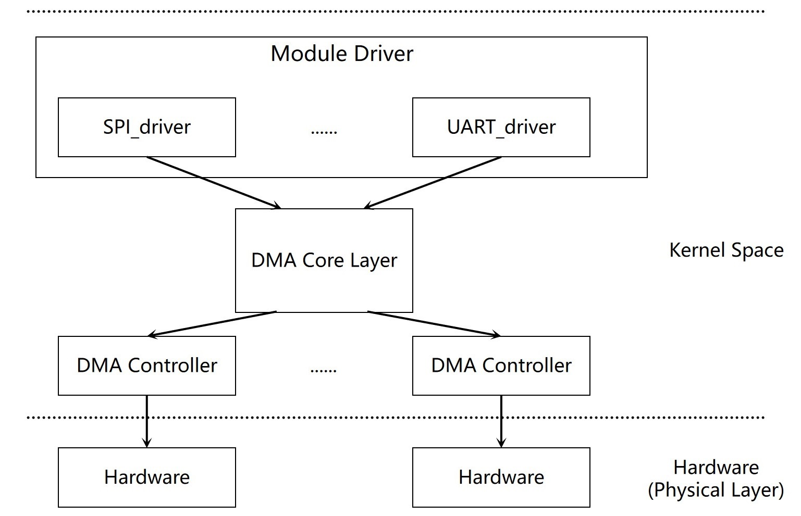

# DMA

介绍 DMA 控制器的配置方法及外设通过 DMA-Slave 使用 DMA 的方式。

## 模块介绍

**DMA（Direct Memory Access，直接内存访问）** 是一种无需 CPU 直接控制的高速数据传输方式。它通过硬件建立起源地址与目标地址之间的数据通路，从而提高系统效率。

本模块为 DMA Controller（即 DMA Master），主要负责调度 DMA Channel 资源，实现数据搬运任务。

### 功能介绍



通过 DMA 框架和 K3 平台的 DMA 控制器驱动，实现以下传输方式：

- 内存到内存
- 内存到外设
- 外设到内存

并支持如下三种传输形式：

- 内存搬运
- 散列表传输
- 环形 Buffer 传输

### 源码结构介绍

DMA 控制器相关源码位于 `drivers/dma` 目录下：

```
drivers/dma
|--dmaengine.c dmaengine.h      #内核 DMA 框架代码
|--dmatest.c                    #内核 DMA 测试代码
|--mmp_pdma.c                   #K3 PDMA 控制器驱动（上游 mainline）
```

K3 使用的 PDMA 驱动为上游 mainline 的 `mmp_pdma.c`，compatible 为 `spacemit,k1-pdma`。

## 关键特性

### 特性

- 支持三种方向传输：内存到内存，内存到外设，外设到内存
- 两组 PDMA 控制器：pdma（16 路 channel，默认启用）和 pdma1（16 路 channel，默认禁用，用于安全域）
- 支持 Burst 长度：8 / 16 / 32 / 64
- 单次描述符传输支持最大 8191 Bytes
- 支持 64 位地址寻址（LPAE，Long Physical Address Extension），可访问 4GB 以上内存
- 支持 1 / 2 / 4 字节数据宽度

## 配置介绍

主要包括 **驱动使能配置** 和 **DTS 配置**

### CONFIG 配置

`CONFIG_DMADEVICES`：为内核平台 DMA 框架提供支持，开启内核 DMA 框架支持，应为 `Y`

```
Symbol: DMADEVICES [=y]
Device Drivers
      -> DMA Engine support (DMADEVICES [=y])
```

在支持平台层 DMA 框架后，配置 `CONFIG_MMP_PDMA` 为 `Y`，启用 K3 PDMA 控制器驱动：

```
Symbol: MMP_PDMA [=y]
Device Drivers
      -> DMA Engine support (DMADEVICES [=y])
            -> MMP PDMA support (MMP_PDMA [=y])
```

K3 SDK 的 defconfig 中上述选项及 `CONFIG_DMATEST` 均已开启。

### DTS 配置

DMA 的使用方法是 **选择一个通道** 并 **指定起始地址和目标地址**，如内存到内存，内存到外设等。

本节介绍：
- 在 DTS 中使能 DMA 控制器
- 为具体设备（如 SPI）配置 DMA 支持

#### DMA 控制器配置示例

Linux 源码中的 `arch/riscv/boot/dts/spacemit/k3.dtsi` 已包含 DMA 控制器节点；下面给出按 DT binding 推荐的写法示例：

```c
pdma: pdma@d4000000 {
    compatible = "spacemit,k1-pdma";
    reg = <0x0 0xd4000000 0x0 0x4000>;
    interrupt-parent = <&saplic>;
    interrupts = <72 IRQ_TYPE_LEVEL_HIGH>;
    clocks = <&syscon_apmu CLK_APMU_DMA>;
    resets = <&syscon_apmu RESET_APMU_DMA>;
    #dma-cells= <1>;
    dma-channels = <16>;
    status = "okay";
};
```

此节点配置了 DMA 的时钟、复位资源和通道数（16 路）。实际传输时的 burst 大小由外设驱动通过 `dma_slave_config` 的 `src_maxburst` / `dst_maxburst` 在运行时指定，驱动支持 8 / 16 / 32 / 64 字节。

K3 还有一组安全域 PDMA 控制器 pdma1（地址 0xf0600000），当前 DTS 中默认禁用：

```c
pdma1: pdma@f0600000 {
    compatible = "spacemit,k1-pdma";
    reg = <0x0 0xf0600000 0x0 0x4000>;
    interrupt-parent = <&saplic>;
    interrupts = <150 IRQ_TYPE_LEVEL_HIGH>;
    #dma-cells= <1>;
    dma-channels = <16>;
    status = "disabled";
};
```

> **注意：** K3 的 `#dma-cells` 为 1（仅需指定 DMA 请求号），在 DTS 中引用 DMA 通道时按该格式填写即可。

#### DMA-Slave 使用 DMA 的配置示例

这里以 SPI0 为例，在 SPI0 的节点下添加下述属性，其中宏 `DMA_SSP0_TX` 和 `DMA_SSP0_RX` 在 `include/dt-bindings/dma/k3-dmac.h` 文件里定义：

```c
dmas = <&pdma DMA_SSP0_TX
        &pdma DMA_SSP0_RX>;
dma-names = "tx", "rx";
```

#### DMA 通道映射

K3 PDMA 的 DMA 请求号定义在 `include/dt-bindings/dma/k3-dmac.h` 中，主要映射如下：

| 外设 | TX 请求号 | RX 请求号 |
|------|-----------|-----------|
| UART0 | 3 | 4 |
| UART2 | 5 | 6 |
| UART3 | 7 | 8 |
| UART4 | 9 | 10 |
| UART5 | 25 | 26 |
| UART6 | 27 | 28 |
| UART7 | 29 | 30 |
| UART8 | 31 | 32 |
| UART9 | 33 | 34 |
| UART10 | 53 | 54 |
| I2C0 | 11 | 12 |
| I2C1 | 13 | 14 |
| I2C2 | 15 | 16 |
| I2C4 | 17 | 18 |
| I2C5 | 35 | 36 |
| I2C6 | 37 | 38 |
| I2C8 | 41 | 42 |
| SSP3 | 19 | 20 |
| SSPA0 | 21 | 22 |
| SSPA1 | 23 | 24 |
| SSPA2 | 56 | 57 |
| SSPA3 | 58 | 59 |
| SSPA4 | 60 | 61 |
| SSPA5 | 62 | 63 |
| SSP0 | 64 | 65 |
| SSP1 | 66 | 67 |
| QSPI | 85 | 84 |
| CAN0 | — | 43 |
| CAN1 | — | 44 |
| CAN2 | — | 51 |
| CAN3 | — | 52 |

pdma1（安全域）的通道映射定义在同一头文件的 `DMA_SEC_*` 宏中，用于安全域外设（如 SEC_UART1、SEC_SSP2、SEC_I2C3）。

## 接口介绍

### API 介绍

Linux 内核实现了申请 DMA 通道，配置 DMA 传输，准备资源，启动传输等接口。

常用：

- 申请通道
```c
struct dma_chan *dma_request_chan(struct device *dev, const char *name)
```

- 配置通道参数，如传输宽度，数据量，起始/目标地址
```c
static inline int dmaengine_slave_config(struct dma_chan *chan,
                                          struct dma_slave_config *config)
```

- 下述三个接口实现了 DMA 开始传输前的准备资源
```c
dmaengine_prep_dma_memcpy
dmaengine_prep_slave_sg
dmaengine_prep_dma_cyclic
```

- 将描述符加入到传输任务的链表里
```c
static inline dma_cookie_t dmaengine_submit(struct dma_async_tx_descriptor *desc)
```

- 开始传输
```c
static inline void dma_async_issue_pending(struct dma_chan *chan)
```

- 释放通道
```c
static inline void dma_release_channel(struct dma_chan *chan)
```

- 停止传输，如音频播放时暂停
```c
static inline int dmaengine_terminate_all(struct dma_chan *chan)
```

## 测试介绍

由于在内存到设备或设备到内存的数据通路工作中需要外设的驱动配合，如 SPI 在发送数据时要将数据通过 DMA 从内存搬运到 SPI TX FIFO 里，这里 DMA 需要 SPI 来控制启动。所以一般在测试时我们采用内存到内存的数据通路，可直接使用内核自带的 `dmatest.c` 程序。

```
echo dma0chan8 > /sys/module/dmatest/parameters/channel  #选择一个没有使用的通道
echo 1 > /sys/module/dmatest/parameters/iterations  #设置传输次数，这里以1为例
echo 4096 > /sys/module/dmatest/parameters/transfer_size #设置传输数据量大小
echo 1 > /sys/module/dmatest/parameters/run   #开始传输
```

> **注：** 使用前请确保内核启用了 `CONFIG_DMATEST`，K3 SDK defconfig 已默认开启。

## FAQ
