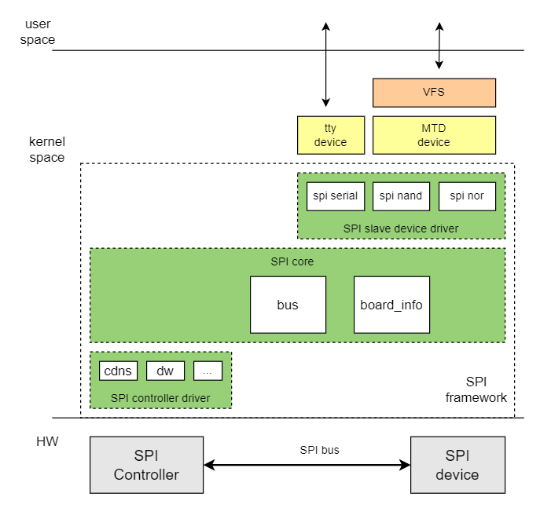

# SPI

介绍 SPI 的功能和使用方法。

## 模块介绍

**SPI（Serial Peripheral Interface）** 是一种 SoC 与外设之间的串行通信接口，仅支持 x1 模式。SPI 有主设备（Master）和从设备（Slave）两种模式，通常为一个主设备控制一个或多个从设备进行通信。主设备选择一个从设备进行通信，完成数据交互。主设备负责提供时钟，并发起读写操作。K3 SPI 当前仅支持主设备模式。


### 功能介绍

  

Linux SPI 驱动框架分为三层：**SPI Core**、**SPI 控制器驱动**、**SPI 设备驱动**。
- **SPI Core** 主要作用：
   - 负责 SPI 总线和 `spi_master` 类的注册  
   - SPI 控制器添加和删除  
   - SPI 设备添加和删除  
   - SPI 设备驱动注册与注销  

- **SPI 控制器驱动：**
   - SPI Master 控制器驱动，对 SPI Master 控制器进行操作

- **SPI 设备驱动：**
   - 实现与具体 SPI 外设的通信。

### 源码结构介绍

控制器驱动代码位于 `drivers/spi` 目录下:  

```
|-- drivers/spi/spi-spacemit-k1.c              #K3 SPI 驱动
```

## 关键特性

### 特性

| 特性 | 特性说明 |
| :-----| :----|
| 通信协议 | 支持 SSP/SPI/MicroWire/PSP 协议 |
| 通信频率 | 最高频率支持 52Mbps, 最低频率支持 6.3Kbps |
| 通信倍数 | x1 | 
| 支持外设 | 支持 SPI-NOR 和 SPI-NAND 闪存 | 

### 性能参数

- **通信频率**
通讯频率只支持 51.2M / 25.6M / 12.8M / 6.4M / 3.2M / 1.6M / 1M / 200k

- **通信倍速**
SPI 通信倍速支持 x1。

**测试方法**  
使用示波器或逻辑分析仪检测 SCK 信号频率。

## 配置介绍

主要包括 **驱动使能配置** 和 **DTS 配置**

### CONFIG 配置

`CONFIG_SPI`：为 SPI 总线协议提供支持，默认情况，此选项为 `Y`
```
Device Drivers
        SPI support (SPI [=y])
```

`CONFIG_SPI_K1`：为 K1/K3 SPI 控制器驱动提供支持，默认情况下，此选型为 `Y`
```
Device Drivers
        SPI support (SPI [=y])
                Spacemit K1 SPI Controller (SPI_K1 [=y])

```

### DTS 配置

#### pinctrl

参考方案原理图，查找 SPI 所使用的引脚组。参考 [PINCTRL](01-PINCTRL.md)，确认所使用的引脚配置，例如：

假设 spi3 可以直接采用 `k1-x_pinctrl.dtsi` 中定义 `pinctrl_ssp3_0` 组。

#### SPI 设备配置

配置 SPI 设备时需要确认**设备类型**以及**通信频率**相关参数。

- **设备类型**
确认挂载在 SPI 总线下的设备类型，如 SPI-NOR 或 SPI-NAND。

- **通信频率**
明确 SPI 控制器与 SPI 设备之间的最大通信速率。 

- **通信倍速**
SPI 通信倍速支持 x1 模式。

SPI 设备 DTS 配置示例：
以 SPI NOR 为例，配置最大通信频率为 26 MHz，收发均采用 x1 模式。

```c
&spi3 {
	pinctrl-0 = <&ssp3_0_cfg>;
	pinctrl-names = "default";
	status = "okay";

	flash@0 {
		compatible = "jedec,spi-nor";
		reg = <0>;
		spi-max-frequency = <26500000>;
		m25p,fast-read;
		broken-flash-reset;
		vcc-supply = <&vcc_3v3_sys>;
		status = "okay";
	};
};
```

## 接口介绍

### API 介绍

**设备驱动注册与注销**

```
int __spi_register_driver(struct module *owner, struct spi_driver *sdrv);  
void spi_unregister_driver(struct spi_driver *sdrv);
```

**数据传输 API**

- 初始化 `spi_message`

```
void spi_message_init(struct spi_message *m);
```

- 添加 `spi_transfer` 到 `spi_message` 的 transfer 列表

```
void spi_message_add_tail(struct spi_transfer *t, struct spi_message *m);
```

- 写数据

```
int spi_write(struct spi_device *spi, const void *buf, size_t len);
```

- 读数据

```
int spi_read(struct spi_device *spi, void *buf, size_t len);
```

- 同步传输 `spi_message`

```
int spi_sync(struct spi_device *spi, struct spi_message *message);
```

## Debug 介绍

### sysfs

查看系统 SPI 总线设备和驱动信息
`/sys/bus/spi`

```
|-- devices                 //spi总线上的设备
|-- drivers                 //spi总线上注册的设备驱动
|-- drivers_autoprobe
|-- drivers_probe
`-- uevent
```

### debugfs

用于查看系统中 SPI 设备信息
`/sys/kernel/debug/spi-nor/spi3.0`

## 测试介绍

### SPI NAND/NOR 读写速率测试

1. 打开 `CONFIG_MTD_TESTS`

```
Device Drivers
         Memory Technology Device (MTD) support (MTD [=y])
                MTD tests support (DANGEROUS) (MTD_TESTS [=m])   
```

2. 运行测试命令

```
insmod mtd_speedtest.ko dev=0   #0表示spi-nand/nor的mtd设备号
```

## FAQ
