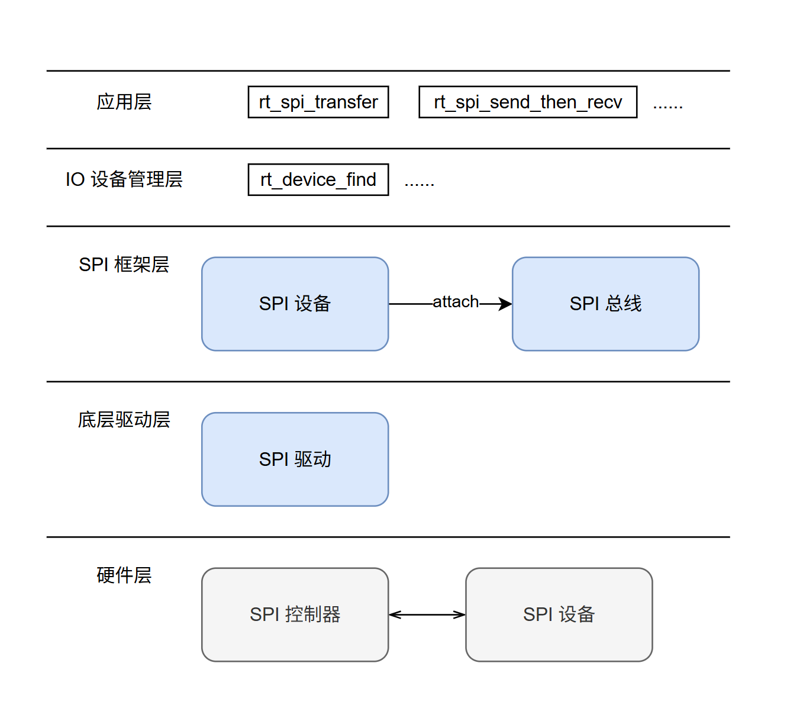

# SPI

介绍小核端（RT-Thread）SPI 的功能和使用方法。

## 模块介绍

**SPI（Serial Peripheral Interface）** 是一种 SoC 与外设之间的串行通信接口，仅支持 x1 模式。SPI 有主设备（Master）和从设备（Slave）两种模式，通常为一个主设备控制一个或多个从设备进行通信。主设备负责提供时钟，并发起读写操作。K3 SPI 当前在小核端仅支持主设备模式。

### 功能介绍



RT-Thread 的 SPI 驱动框架属于 I/O 设备管理框架的一部分，自上而下分为三层：

- **I/O 设备管理层与 SPI 框架层：**
  - 由 RT-Thread 框架提供，包含 SPI 总线设备 (`struct rt_spi_bus`) 和 SPI 从设备 (`struct rt_spi_device`) 的抽象。
  - 提供统一的面向应用层的 API（如 `rt_spi_transfer`、`rt_spi_send_then_recv` 等）。
- **SPI 控制器驱动（BSP 驱动）：**
  - K3 SPI 硬件控制器的底层实现。负责实现 SPI 框架层要求的硬件操作接口，如配置总线、底层数据收发处理等。
- **SPI 设备驱动：**
  - 挂载在 SPI 总线上的具体外设驱动（如 SPI NOR Flash 驱动、SPI 传感器驱动等）。

### 源码结构介绍

控制器驱动代码位于 `bsp/spacemit/drivers/spi` 目录下:

```text
|-- bsp/spacemit/drivers/spi/k1x_spi.c       # K3 SPI 底层控制器驱动
```

## 关键特性

### 特性

与大核使用同一个硬件 IP，硬件特性同样为：

| 特性     | 特性说明                                       |
| :------- | :--------------------------------------------- |
| 通信协议 | 支持 SSP/SPI/MicroWire/PSP 协议                |
| 通信频率 | 最高频率支持 52Mbps, 最低频率支持 800Kbps      |
| 通信倍数 | x1                                             |
| 支持外设 | 支持 SPI-NOR 和 SPI-NAND 闪存、各类 SPI 传感器 |

### 性能参数

- **通信频率**
通讯频率只支持 51.2M / 25.6M / 12.8M / 6.4M / 3.2M / 1.6M / 800k

- **通信倍速**
SPI 通信倍速支持 x1 模式。

**测试方法：** 使用示波器或逻辑分析仪检测 SCK 信号频率。

## 配置介绍

包括 **驱动使能** 和 **DTS** 配置。

### CONFIG 配置

**1. 开启 SPI 框架支持：** `RT_USING_SPI` (默认: N)
```text
-> RT-Thread Components
  -> Device Drivers
    [*] Using SPI Bus/Device device drivers
```

**2. 开启 SPI 控制器支持：** `BSP_USING_SPI` (默认: N)
```text
-> Hardware Drivers Config
  -> On-chip Peripheral Drivers
    [*] Enable SPI
```

**3. 开启 DMA 框架支持 (SPI 依赖)：** `RT_USING_DMA` (默认: N)
```text
-> RT-Thread Components
  -> Device Drivers
    [*] Using Direct Memory Access (DMA)
```

**4. 开启 DMA 控制器支持 (SPI 依赖)：** `BSP_USING_DMA` (默认: N)
```text
-> Hardware Drivers Config
  -> On-chip Peripheral Drivers
    [*] Enable DMA
```

### DTS 配置

#### pinctrl

参考方案原理图，查找 `rspi` 所使用的引脚组，确认所使用的引脚配置，参考 [pinctrl](pinctrl.md) 。假设 `rspi0` 可以直接采用 `k3_pinctrl.dtsi` 中定义的 `rssp0_0_cfg` 组。

#### 配置示例

```c
&rspi0 {
    pinctrl-names = "default";
    pinctrl-0 = <&rssp0_0_cfg>;
    status = "okay";
};
```

## 示例使用

### API 介绍

RT-Thread 提供了标准化的 SPI 操作接口供应用层或外设驱动调用。

**查找并获取 SPI 设备**

```c
rt_device_t rt_device_find(const char *name);
```

**将 SPI 从设备挂载 (Attach) 到主设备总线**
```c
rt_err_t rt_spi_bus_attach_device(struct rt_spi_device *device,
                                  const char           *name,
                                  const char           *bus_name,
                                  void                 *user_data);
```

**配置 SPI 设备参数**

```c
rt_err_t rt_spi_configure(struct rt_spi_device *device, struct
                          rt_spi_configuration *cfg);
```

**数据传输 API**

- 自定义传输 (支持灵活读写)

```c
rt_size_t rt_spi_transfer(struct rt_spi_device *device, const void *send_buf,
                          void *recv_buf, rt_size_t length);
```

- 发送数据

```c
rt_size_t rt_spi_send(struct rt_spi_device *device, const void *send_buf,
                      rt_size_t length);
```

- 先发送后接收 (常用于读取寄存器，片选在整个过程中保持拉低)

```c
rt_err_t rt_spi_send_then_recv(struct rt_spi_device *device, const void
                               *send_buf, rt_size_t send_length,
                               void *recv_buf,
                               rt_size_t recv_length);
```
## 应用开发

请参考文件：bsp/spacemit/drivers/spi/k1x_spi_test.c

## Debug 介绍

### MSH 命令行

RT-Thread 提供 MSH 命令行来查看系统设备状态。

**查看总线和设备注册情况：**

在终端输入 `list_device`：

```shell
msh >list_device
device           type         ref count
-------- -------------------- ----------
rspi00   SPI Device           0       # 挂载的 SPI 设备
rspi0    SPI Bus              0       # 注册的 SPI 控制器总线
uart0    Character Device     2
```

## 测试介绍

### SPI 多频点测试

可以使用 MSH 中的 `spi_test` 命令来测试控制器读写设备。

**1. 打开宏配置：** `BSP_SPI_TEST`
```text
-> Hardware Drivers Config
  -> On-chip Peripheral Drivers
    -> Enable SPI (BSP_USING_SPI [=y])
      [*] Enable spi test driver
```

**2. MSH 中使用 `spi_test` 命令：**

- `spi_test 0`：使用默认频率进行读写测试。
- `spi_test 1`：遍历使用 800k 到 51.2M 之间所有支持的频点进行读写测试。

## 附录

## FAQ